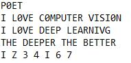

# Hand-Written-Text-Recognition
This project includes a partial implementation of pytorch library, named Mytorch. The library is used to construct a fully connected neural network for hand-written text recognition. 
## Introduction
Mytorch is a partial implementation of Pytorch library. It includes a framework of automatic differentiation (autograd). During forward propagation, autograd will automatically construct a computational graph. During back propagation, the gradients of operations that require gradient will be calculated automatically through recursion. Other functionalities of Mytorch include: ReLU activation, cross entropy loss function, and SGD optimizer. A neural network was constructed using Mytorch and was trained on MNIST dataset.

Another portion of this project is an image processing implementation. In this portion a hand-written note is given and the image processing function will detect and crop texts from it. The cropped texts are arranged by the same order as they appear in the image, and then fed into the neural network for classification. 

## Train
Model structre:
```
Linear(1024, 128)
ReLU()
Linear(128, 36)
```

The model was trained for 15 epochs with batch size of 50, and achieved 92% of validation accuracy.

## Test
Test image:
<div align="center">
  
</div>

Convert to binary image:
<div align="center">
  
</div>

Create bounding boxes:
<div align="center">
  
</div>

Crop texts:
<div align="center">
  
  
</div>

Inference:
<div align="center">
  
</div>
<div align="center">
  
</div>
The model sometimes failed to recognize hard samples such as "0" and "O", "1" and "I", "Z" and "2"
